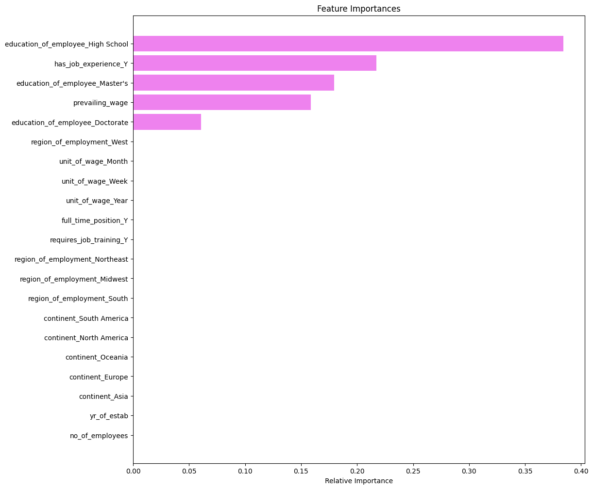

## Applying Ensemble Methods and Model Tuning in Machine Learning
To lay the groundwork for this project, the foundations of Advanced Machine Learning were built through the study of Ensemble Methods such as Bagging, Random Forest, Boosting, AdaBoost, Gradient Boosting, XGBoost, and Stacking. Emphasis was placed on understanding the distinctions among these techniques and evaluating how their performance varies under different scenarios. The learning was further extended to Model Optimization techniques, including Cross-Validation, Over-Sampling and Under-Sampling, Hyperparameter Tuning, Grid Search, and RandomizedSearchCV. Through these approaches, strategies for improving model accuracy, mitigating Bias and Variance, and addressing Imbalanced Data were demonstrated.

OrgPad is a flexible online whiteboard that enables clear and visual organization of ideas and notes. In this case, it was used to create a structured mind map and capture key concepts of advanced machine learning such as ensemble methods and model tuning. Access the mind map and notes [Advanced Machine Learning](https://orgpad.info/s/z6ECHTI3AJX).


[](https://orgpad.info/s/z6ECHTI3AJX)

The solution approach for the problem statement involved training 18 models, evaluating them based on recall, and hyperparameter tuning the top 8, resulting in the selection of the best-performing AdaBoost model. As revealed by the AdaBoost model's feature importance, we arrived at the top 3 features as driving factors for visa certification.


## Problem Statement

EasyVisa has been hired to provide data-driven solutions for streamlining the visa approval process.
The task is to analyze the given dataset of visa applications to identify the key factors that influence approval decisions.
Using this analysis, EasyVisa needs to build a classification model to predict the chances of visa approval.
The model should help in shortlisting candidates with higher approval probability.
Finally, EasyVisa must provide recommendations on applicant profiles that are more or less likely to be certified.


### Data Description

The data contains the different attributes of the employee and the employer. The detailed data dictionary is given below.

1. case_id: ID of each visa application
2. continent: Information of continent of the employee
3. education_of_employee: Information of education of the employee
4. has_job_experience: Does the employee has any job experience? Y = Yes; N = No
5. requires_job_training: Does the employee require any job training? Y = Yes; N = No
6. no_of_employees: Number of employees in the employer's company
7. yr_of_estab: Year in which the employer's company was established
8. region_of_employment: Information of foreign worker's intended region of employment in the US.
9. prevailing_wage: Average wage paid to similarly employed workers in a specific occupation in the area of intended employment. The purpose of the prevailing wage is to ensure that the foreign worker is not underpaid compared to other workers offering the same or similar service in the same area of employment.
10. unit_of_wage: Unit of prevailing wage. Values include Hourly, Weekly, Monthly, and Yearly.
11. full_time_position: Is the position of work full-time? Y = Full-Time Position; N = Part-Time Position
12. case_status: Flag indicating if the Visa was certified or denied

### Environment Setup
1. Python virtual environment:

```bash
# Create a virtual environment
python -m venv .venv

# Activate the virtual environment
# On Windows
.venv\Scripts\activate
# On macOS/Linux
source .venv/bin/activate
```

2. Install Required Packages

After activating the virtual environment, install the necessary packages listed in `requirements.txt`:
```bash
pip install -r requirements.txt
```
```bash
pip install -r requirements.txt
```

3. Deactivate the Virtual Environment

To deactivate the virtual environment, simply run:

```bash
deactivate
```
